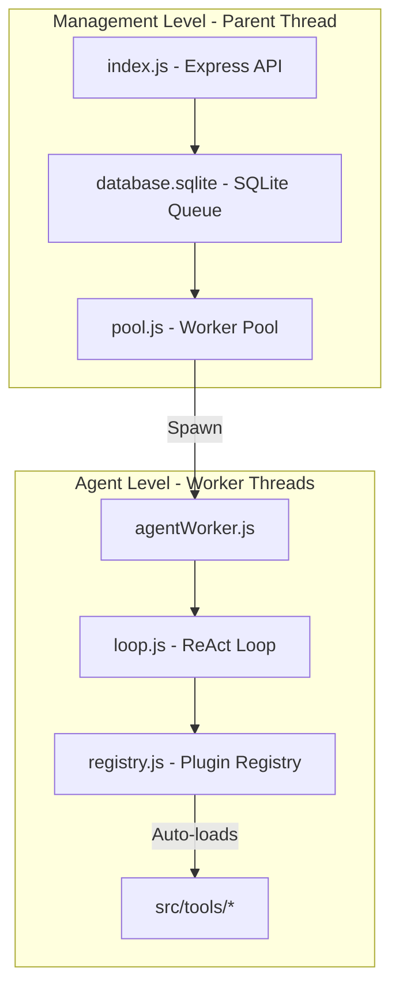

# Compass AI Game Support Agent

Compass is a tool-driven game support agent. The Express server accepts tickets, a worker pool assigns pending tickets, and each worker runs an LLM tool-call loop until the `idle` tool validates completion.

## Project Structure

<<<<<<< Updated upstream
## 1. System Architecture

Compass utilizes a **Circular Agent** pattern. The AI agent communicates exclusively via tool calls and does not send plain text replies directly to players. The codebase is divided into two distinct levels to ensure crash resilience, concurrency, and modularity.



### 1.1 Management Level (Parent Thread)
* **Express Web Server (`src/index.js`)**: Hosts endpoints to serve the web dashboard, submit support tickets, and fetch conversation audit logs.
* **SQLite Database (`src/database/sqlite.js`)**: Low-level infrastructural driver for the ticket queue database. Manages tables, transactions, state mutations, and startup queue cleanups.
* **Worker Pool (`src/worker/pool.js`)**: Polling orchestrator that manages concurrency (capped at 5 tickets), spawns isolated `worker_threads` for pending tickets, and runs an execution watchdog timer to terminate hung workers after `workerTimeoutMs`.
* **Crash Recovery**: During initialization, the manager resets any ticket stuck in `running` status back to `pending` so the queue resumes gracefully on startup.

### 1.2 Agent Level (Worker Threads)
* **Worker Wrapper (`src/worker/agentWorker.js`)**: Runs a dedicated thread per ticket. It manages a temporary `sessionContext` tracking checklist validation flags in thread memory. It exits naturally upon successful loop completion or bubbles unhandled errors up to the parent thread's error listener.
* **ReAct Executor (`src/agent/loop.js`)**: Runs the prompt loop. It sends the conversation history to the model, parses tool requests, handles JSON checkpointing, and enforces the token safety budget.

* **Tool Registry (`src/agent/registry.js`)**: A dynamic plugin broker. It scans the `src/tools/` folder, auto-registers any tool defining a `schema` and a `handler` via dynamic ES imports, and intercepts the `idle` call to run checks.

### 1.3 Services Layer (Domain Services)
* **Ticket Service (`services/ticket/`)**: High-level repository pattern for ticket querying. Resolves ticket information and writes outcomes back to the queue.
* **Incident, KB, & Slang Services (`services/`)**: Isolate system incidents, knowledge base FAQs, and slang databases. These modules encapsulate their own independent data stores (e.g. JSON files or separate databases) completely detached from the core queue database.


---

## 2. Directory Structure

```
compass/
├── package.json               # ESM configuration and project scripts
├── vitest.config.js           # Sequential testing options (no state collisions)
├── .env.example               # Configuration template file
│
├── public/                    # Web Portal (Dashboard Interface)
│   ├── index.html             # Sleek dark-mode dashboard HTML
│   ├── css/
│   │   └── styles.css         # Responsive glassmorphic layout stylesheet
│   └── js/
│       └── app.js             # Form poster, real-time polling, and ReAct log viewer
│
├── services/                  # Business Domain Services (Separate data stores)
│   ├── ticket/                # Ticket reader & writer repository adapter
│   ├── incident/              # Live incident lookup service
│   ├── kb/                    # Knowledge base FAQ query service
│   └── slang/                 # Slang glossary lookup & feedback service
│
└── src/                       # Agent Core
    ├── index.js               # Entry point & Express routes
    ├── config.js              # Centralized configs and system prompts
    ├── database/
    │   ├── sqlite.js          # SQLite queue database driver (infrastructural)
    │   └── __tests__/
    │       └── sqlite.test.js # Queue driver unit tests
    │
    ├── worker/
    │   ├── pool.js            # Worker thread orchestrator
    │   ├── agentWorker.js     # Thread wrapper & session validator
    │   └── __tests__/
    │       └── pool.test.js   # Pool & thread lifecycle tests
    │
    ├── agent/
    │   ├── loop.js            # Core ReAct loop & LLM requester
    │   ├── registry.js        # Plugin-style auto-registering broker
    │   └── __tests__/
    │       └── loop.test.js   # Loop, budget, & tail validation tests
    │
    ├── tools/                 # Dynamic Tools Folder (Add your files here)
    │   ├── idle.js            # System completion tool
    │   ├── read_ticket.js     # Ticket content stub
    │   ├── ... (other stubs)  # Modals stubs
    │   └── __tests__/
    │       └── idle.test.js   # Individual tool unit tests
    │
    └── utils/
        └── logger.js          # Color-coded console logger printing thread IDs
=======
```text
compass/
|-- data/                  # Generated SQLite databases (gitignored)
|-- public/                # Browser dashboard
|   |-- css/
|   |-- js/
|   `-- index.html
|-- resources/
|   |-- source/            # Original import source files
|   `-- sql/               # Database schemas and seed data
|-- scripts/               # Database initialization/import commands
|-- src/
|   |-- agent/             # LLM execution loop and tool registry
|   |-- database/          # Main SQLite adapter
|   |-- tools/             # Tool schemas and handlers
|   |-- utils/             # Shared utilities
|   |-- worker/            # Worker pool and thread entry point
|   |-- config.js          # Environment configuration and system prompt
|   `-- index.js           # Express application entry point
|-- .env.example
|-- package.json
`-- agent.md
>>>>>>> Stashed changes
```

## Runtime Flow

1. The Express API stores a new ticket in `data/database.sqlite`.
2. The worker pool claims the oldest pending ticket.
3. A worker starts the tool-call loop for that ticket.
4. Tools read ticket, incident, knowledge-base, and slang data.
5. The `idle` tool checks that all required work is complete.
6. The ticket is marked completed or escalated.

## Database Files

- `data/database.sqlite`: ticket queue, incidents, knowledge-base articles, and local slang terms.
- `data/Game Knowledge Base.sqlite`: Valorant terminology and game mechanics.
- `data/slang.sqlite`: imported Gen-Z slang dataset.
- `data/tickets.sqlite`: standalone ticket records.
- `data/incidents.sqlite`: standalone incident records.

Database locations can be overridden with `DB_PATH`, `GAME_KNOWLEDGE_DB_PATH`, and `SLANG_DB_PATH`.

## Commands

```powershell
npm.cmd install
npm.cmd run db:init
npm.cmd run db:init:slang
npm.cmd run db:init:tickets
npm.cmd run db:init:incidents
npm.cmd start
```

`db:init` creates and seeds the Valorant knowledge database. `db:init:slang` downloads and imports `MLBtrio/genz-slang-dataset`. The ticket and incident commands create their respective standalone databases.

## Adding Tools

Add a JavaScript file to `src/tools/` that exports an OpenAI-compatible `schema` and an async `handler(args, sessionContext)`. The registry discovers it automatically at startup.
