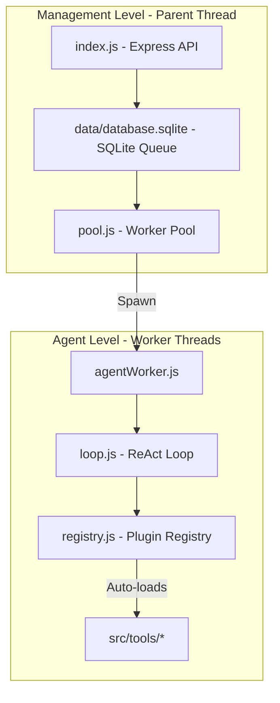

# Compass AI Game Support Agent - Agent Guide

Welcome, Agent! This document outlines the system architecture, file structure, execution flow, and development guidelines for the **Compass Support Agent** project. Use this guide to quickly understand the codebase and learn how to extend it.

---

## 1. System Architecture

Compass utilizes a **Circular Agent** pattern. The AI agent communicates exclusively via tool calls and does not send plain text replies directly to players. The codebase is divided into two distinct levels to ensure crash resilience, concurrency, and modularity.



### 1.1 Management Level (Parent Thread)
* **Express Web Server (`src/index.js`)**: Hosts endpoints to serve the web dashboard, submit support tickets, and fetch conversation audit logs.
* **SQLite Database (`src/database/sqlite.js`)**: Low-level infrastructural driver for the ticket queue database. Manages tables, transactions, state mutations, and startup queue cleanups.
* **Worker Pool (`src/worker/pool.js`)**: Polling orchestrator that manages concurrency (capped at 5 tickets), prevents duplicate workers per ticket, and runs a progress-based inactivity watchdog.
* **Crash Recovery**: During initialization, the manager resets any ticket stuck in `running` status back to `pending` so the queue resumes gracefully on startup.

### 1.2 Agent Level (Worker Threads)
* **Worker Wrapper (`src/worker/agentWorker.js`)**: Runs a dedicated thread per ticket. It initializes workflow revision and checklist state, which the loop reconstructs from successful persisted tool outcomes after interruption.
* **ReAct Executor (`src/agent/loop.js`)**: Runs the prompt loop. It sends the conversation history to the model, parses tool requests, handles JSON checkpointing, and enforces the token safety budget.

* **Tool Registry (`src/agent/registry.js`)**: A dynamic plugin broker. It scans the `src/tools/` folder, auto-registers any tool defining a `schema` and a `handler` via dynamic ES imports, and intercepts the `idle` call to run checks.

### 1.3 Services Layer (Domain Services)
* **Ticket Service (`services/ticket/`)**: High-level repository pattern for ticket querying. Resolves ticket information and writes outcomes back to the queue.
* **Incident, KB, & Slang Services (`services/`)**: Isolate system incidents, knowledge base FAQs, and slang databases. These modules encapsulate their own independent data stores (e.g. JSON files or separate databases) completely detached from the core queue database.


---

## 2. Directory Structure

```
compass/
├── package.json               # ESM configuration and project scripts
├── vitest.config.js           # Sequential testing options (no state collisions)
├── .env.example               # Configuration template file
│
├── public/                    # Web Portal (Dashboard Interface)
│   ├── index.html             # Sleek dark-mode dashboard HTML
│   ├── css/
│   │   └── styles.css         # Responsive glassmorphic layout stylesheet
│   └── js/
│       └── app.js             # Form poster, real-time polling, and ReAct log viewer
│
├── services/                  # Business Domain Services (Separate data stores)
│   ├── ticket/                # Ticket reader & writer repository adapter
│   ├── incident/              # Live incident lookup service
│   ├── kb/                    # Knowledge base FAQ query service
│   └── slang/                 # Slang glossary lookup & feedback service
│
└── src/                       # Agent Core
    ├── index.js               # Entry point & Express routes
    ├── config.js              # Centralized configs and system prompts
    ├── database/
    │   ├── sqlite.js          # SQLite queue database driver (infrastructural)
    │   └── __tests__/
    │       └── sqlite.test.js # Queue driver unit tests
    │
    ├── worker/
    │   ├── pool.js            # Worker thread orchestrator
    │   ├── agentWorker.js     # Thread wrapper & session validator
    │   └── __tests__/
    │       └── pool.test.js   # Pool & thread lifecycle tests
    │
    ├── agent/
    │   ├── loop.js            # Core ReAct loop & LLM requester
    │   ├── registry.js        # Plugin-style auto-registering broker
    │   └── __tests__/
    │       └── loop.test.js   # Loop, budget, & tail validation tests
    │
    ├── tools/                 # Dynamic Tools Folder (Add your files here)
    │   ├── idle.js            # System completion tool
    │   ├── read_ticket.js     # Ticket content stub
    │   ├── ... (other stubs)  # Modals stubs
    │   └── __tests__/
    │       └── idle.test.js   # Individual tool unit tests
    │
    └── utils/
        └── logger.js          # Color-coded console logger printing thread IDs
```

---

## 3. Key Agent Design Patterns

If you are modifying the core agent logic, pay close attention to these patterns:

### 3.1 Context Token Safety Valve
To prevent runaway model completions and save budget, `loop.js` tracks cumulative token usage. 
* It extracts **`response.data.usage.total_tokens`** from the OpenAI-compatible completions API response.
* If the token count exceeds the `contextTokenBudget` (60,000 tokens), it exits the loop immediately, updates the status in SQLite to `escalated` (reason: `Context token limit reached`), and logs the event.

### 3.2 History Recovery and Workflow Revisions
If a thread crashes mid-turn, the history file (`src/data/history/{ticketId}.json`) might contain an assistant message listing `tool_calls` without matching `tool` results.
* History is written through atomic temporary-file renames.
* On startup, `loop.js` adds structured interruption results for unmatched tool calls, preserving valid completed calls.
* Successful structured tool results reconstruct checklist flags after a worker restart.
* Player replies increment a SQLite workflow revision. The next worker appends one revision-specific wake-up message and reprocesses the ticket without racing the previous worker's history writes.

### 3.3 Dynamic Tool Registration (Plugin System)
`src/agent/registry.js` uses dynamic ESM imports:
* It reads `src/tools/` for any `.js` file (excluding tests).
* It performs `await import("file://...")`.
* Every module must export a valid `schema.function.name` and `handler`; duplicate or invalid tools fail startup instead of creating a partial registry.
* To add a tool, simply create a file in `src/tools/` exporting these properties. No static imports are needed.

### 3.4 Local In-Worker Validation (The `idle` Contract)
When the model invokes the `idle` tool:
1. `registry.js` intercepts it and checks `sessionContext.flags`.
2. It verifies that `wasTicketRead`, `wasIncidentsChecked`, `wasClassified`, `wasResponseDrafted`, and `wasRouted` are all `true`.
3. Flags are set only after a handler succeeds. If checks fail, `idle` returns a structured, non-terminal `WORKFLOW_INCOMPLETE` result so the model can correct the missing work.
4. Successful finalization writes status, resolution type, and resolution reason in one transaction. If a newer player reply is pending, finalization does not overwrite it.

---

## 4. Multi-Provider (OpenAI & Llama.cpp)

The system supports switching between standard OpenAI API and a local model running on `llama.cpp`'s server. Change this in the `.env` file:

* **OpenAI mode**: Resolves `https://api.openai.com/v1/chat/completions` using the `OPENAI_API_KEY` header.
* **Llama.cpp mode**: Resolves `${LLAMACPP_URL}/v1/chat/completions` (default `http://localhost:8080`), uses longer request timeouts (120 seconds) for slow local hardware, and does not require an API key to run.

---

## 5. Development & Running Tests

### Install dependencies
```bash
npm install
```

### Running unit tests (Vitest)
Unit tests are configured to run sequentially (`fileParallelism: false`) to avoid collisions on the shared `:memory:` database instance.
```bash
npm test
```

### Extending with new tools
To create a new tool, create `src/tools/{tool_name}.js` with this structure:
```javascript
export const schema = {
  type: 'function',
  function: {
    name: 'tool_name',
    description: 'Describe the tool and its parameters here.',
    parameters: {
      type: 'object',
      properties: {
        param1: { type: 'string', description: 'Parameter description' }
      },
      required: ['param1']
    }
  }
};

export async function handler(args, sessionContext) {
  const { param1 } = args;
  // Implement logic (e.g. query database service)
  return `Processed tool with ${param1}`;
}
```
If you want to write a test, create `src/tools/__tests__/{tool_name}.test.js` using Vitest syntax.
